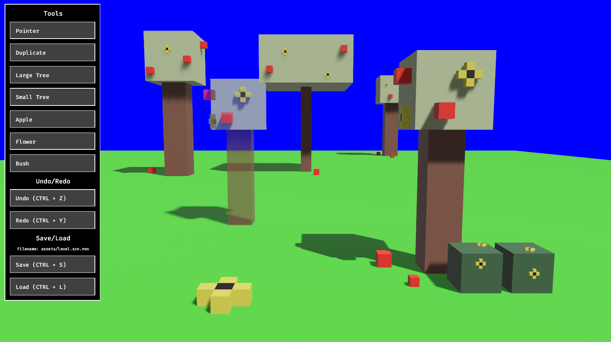

# Bevy Garden

A simple `bevy` game where you plant trees in a garden, featuring a simple editor interface, common patterns
regarding state-management and multiple examples for interacting with bevy scenes.

---



## Usage

```shell
cargo run
```

## Features

This example showcases the following:

* Spawn objects from [asset files](assets/tools).
* Capture object to scene.
* Tool library and tool stack.
* Saving and loading.
* Undo and redo (also via [save](crates/save/src) crate).
* Treat objects made up of multiple entities as a single object.
* Multiple examples working with `bevy` scenes:
  * Modifying scenes before spawning (centering, adding components etc.).
  * Dealing with `Parent`/`Children` hierarchies in scenes.
  * Spawning scenes directly into the world, without using `DynamicSceneBundle`.
  * See [bevy_scene_utils](crates/bevy_scene_utils/src), [save](crates/save/src),
    [duplicate_tool](crates/duplicate_tool/src) and [prefab_tool](crates/prefab_tool/src/commands.rs) for examples.

## Third-Party Bevy Crates

The following third-party crates are used:

- [bevy_asset_loader](https://github.com/NiklasEi/bevy_asset_loader) - Load assets in loading states.
- [bevy_common_assets](https://github.com/NiklasEi/bevy_common_assets) - Custom `ron` assets.
- [bevy_mod_raycast](https://github.com/aevyrie/bevy_mod_raycast) - Ray casting and picking.

## Credits

- [bevy_save](https://github.com/hankjordan/bevy_save) - I copied the idea of the `SaveableRegistry` and rollbacks
  from this project (see [save crate](crates/save/src)).

## License

All code in this repository is dual-licensed under either:

- MIT License (LICENSE-MIT or http://opensource.org/licenses/MIT)
- Apache License, Version 2.0 (LICENSE-APACHE or http://www.apache.org/licenses/LICENSE-2.0)

at your option. This means you can select the license you prefer.
